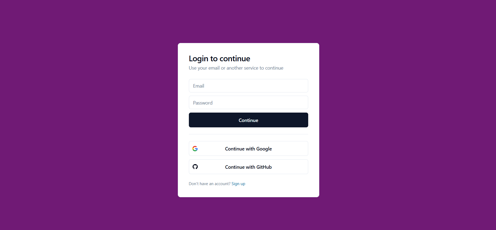

# ⚡ Slack Clone

A real-time Slack clone built with **Next.js**, **Convex**, **TailwindCSS**, **TypeScript**, and **OAuth2** authentication. This project is currently under development.

---

## 🔗 Demo



Check out the live version hosted on Vercel:  
### [Live App](https://slack-clone-gynx9c7g1-viniciusferreira7s-projects.vercel.app/auth)

---

## 🧱 Tech Stack

This project is built using:

- **Next.js** – React framework for SSR/SSG  
- **TypeScript** – modern static typing  
- **Convex** – real-time backend with database and functions  
- **TailwindCSS** – utility-first CSS framework  
- **Jotai** – atomic state management  
- **Quill.js** – rich text editor  
- **OAuth2** – third-party authentication (Google, GitHub, etc.)

---

## 🚀 Features

- OAuth2 login (Google, GitHub, etc.)  
- Real-time messaging  
- Channel creation and switching  
- Rich text editor (bold, emoji, formatting, etc.)  
- Fully responsive design with TailwindCSS  
- Clean and minimal UI  

---

## 📁 Project Structure

```
├─ src/                  # Main source code
│   ├─ app/              # App routes (Next.js App Router)
│   ├─ components/       # Reusable UI components
│   ├─ features/         # Application-specific modules/features
│   ├─ hooks/            # Custom React hooks
│   ├─ lib/              # Utility libraries and services
│   ├─ utils/            # Helper functions
│   └─ middleware.ts     # Route middleware for Next.js
│
├─ convex/               # Convex schemas and server functions
├─ public/               # Static assets (images, icons, etc.)
├─ env/                  # Environment configuration
│   └─ index.ts
├─ .eslintrc.json        # ESLint rules
├─ .prettierrc.json      # Prettier configuration
└─ next.config.ts        # Next.js configuration
```

---

## 🛠️ Getting Started

1. Clone the repository:  
   ```bash
   git clone https://github.com/viniciusferreira7/slack-clone.git
   cd slack-clone
   ```

2. Install dependencies:

   ```bash
   npm install
   # or
   yarn
   ```

3. Set up environment variables in a `.env.local` file:

   ```env
   NEXT_PUBLIC_CONVEX_URL=your_convex_url
   AUTH_GITHUB_ID=your_github_oauth_client_id
   AUTH_GITHUB_SECRET=your_github_oauth_client_secret
   AUTH_GOOGLE_ID=your_google_oauth_client_id
   AUTH_GOOGLE_SECRET=your_google_oauth_client_secret
   ```

4. Start the development server:

   ```bash
   npm run dev
   ```

5. Open your browser at `http://localhost:3000/auth` and log in to start chatting!

---

## 🤝 Contributing

Contributions are welcome! Feel free to open issues or submit pull requests.

---

## 📜 License

This project is licensed under the [MIT License](LICENSE).
Developed by **Vinicius Ferreira**.

---

## 📚 Resources

* [Convex Documentation](https://docs.convex.dev/)
* [Next.js Documentation](https://nextjs.org/docs)
* [TailwindCSS](https://tailwindcss.com/)
* [Jotai](https://jotai.org/)
* [Quill Editor](https://quilljs.com/)

---